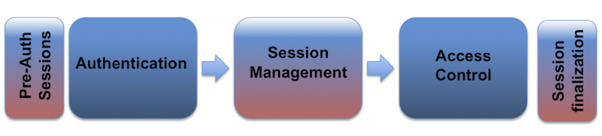

会话管理
==================
在本节中，我们将根据 OWASP's 的安全编码指南介绍会话管理中最重要的一些点。我们会通过分析一个例子来解释这些做法的理由，例子的源码在[这里](session.go)，会话处理的流程图如下：



在处理会话管理时，程序应该只能使用服务器的会话管理来控制，并且这个会话应该是由受信任的系统来创建。在本例中，我们使用 JWT 来生成会话，代码如下：

```go
// create a JWT and put in the clients cookie
func setToken(res http.ResponseWriter, req *http.Request) {
  ...
}
```

为了防止暴力破解，我们需要确保生成会话标志符(`SessionId`)的算法是足够随机的。

```go
...
token := jwt.NewWithClaims(jwt.SigningMethodHS256, claims)
signedToken, _ := token.SignedString([]byte("secret")) //our secret
...
```

既然我们已经有一个很安全的`token`了，现在我们需要做的事情是设置`HTTP cookies`的`Domain`, `Path`, `Expires`, `HTTP only`, `Secure`这些字段的值。在本例中，由于我们认为我们的程序是一个低风险的程序，所以我们把`Expires`设置为 30 分钟。 

```go
// Our cookie parameter
cookie := http.Cookie{
    Name: "Auth",
    Value: signedToken,
    Expires: expireCookie,
    HttpOnly: true,
    Path: "/",
    Domain: "127.0.0.1",
    Secure: true
}

http.SetCookie(res, &cookie) //Set the cookie
```

每次登录，都有应该生成一个新的会话，而旧的会话即使没有过期也不应该使用了。我们给会话设置`Expire`是为了防止会话劫持，另外一个重要的方面是应该要保证一个会话对应一个用户，不要出现一个用户有多个会话的情况。如果才能做到这点呢？可以在数据库里面保存一份已经登录用户的列表，每次一个新的用户登录就去库里检查一下，如果已经存在那么把对应的会话设置为过期。

`SessionId`只应该出现在 HTTP 的 Cookie 响应头里面，而不应该出现在 URL 的里面，一个不好的做法通过是 GET 参数来传递`SessionId`。还有就是`SessionId`必须要做到不能被其它用户未授权访问。

在 HTTP 跳转到 HTTPS 的时候应该特别注意需要预防 MITM 攻击（嗅探，然后悄悄劫持用户的会话），最佳实践是全部都使用 HTTPS。下面例子中的 Web Server 就是使用了 HTTPS。

```go
err := http.ListenAndServeTLS(":443", "cert/cert.pem", "cert/key.pem", nil)
if err != nil {
  log.Fatal("ListenAndServe: ", err)
}
```

在某些高危操作的时候，应该没次操作都需要验证`token`，而且为了防止爆破，`token`还需要保证足够的长度和随机性。

会话管理的最后一点需要考虑的就是**注销**。应用程序应该要提供一个注销的操作，当执行这个操作的时候会清理掉这次会话所有相关的信息包括所有的连接。
在本例中，当用户退出的时候我们会删除存在客户端的 Cookie。同样的需要删除存在服务器端的 Session。

```go
...
cookie, err := req.Cookie("Auth") //Our auth token
if err != nil {
  res.Header().Set("Content-Type", "text/html")
  fmt.Fprint(res, "Unauthorized - Please login <br>")
  fmt.Fprintf(res, "<a href=\"login\"> Login </a>")
  return
}
...
```

完整的例子在 [session.go](session.go)
